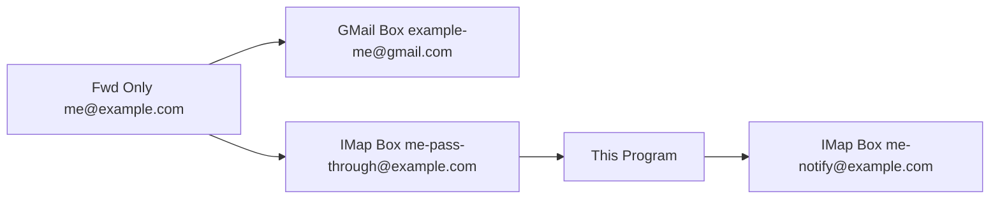
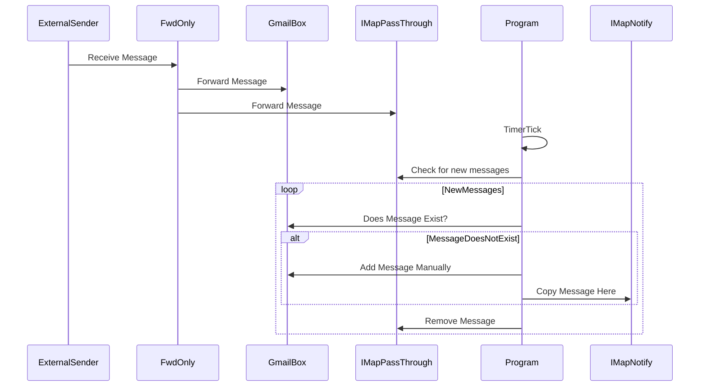

# E-Mail Forward Fixer

There is an issue (with gmail) where emails forwarded from a domain (e.g. me@example.com, noticed when coming from [Dreamhost emails](https://help.dreamhost.com/hc/en-us/articles/115000326592-Using-Gmail-to-access-your-DreamHost-email-account)) to Gmail (e.g. example-me@gmail.com) will occasionally (maybe 1 in 100) get rejected. 

The goal of this is to provide a backup-check where emails that did not successfully forward will still be something that can be quickly notified.

# Architecture

Message Flow



How it runs



# Setup and Execution (Docker)

This project runs inside a Docker container using `docker compose`. By default, it will pull the pre-built `latest` image from DockerHub (`teeks99/email-fwd-fixer:latest`). If you wish to use a specific version, you can edit the `image:` tag in `compose.yml` to target a specific release (e.g., `teeks99/email-fwd-fixer:v1.0.0`).

## 1. Configure the Environment & Passwords

1. Copy the environment template:
   ```bash
   cp .env.example .env
   ```
2. Open `.env` and fill in your IMAP credentials for the PassThrough, Notify, and GMail accounts. 
   - Note: For GMail, you must use an **App Password** (see subsection below).

### Generating a GMail App Password

Because Google has disabled basic authentication for standard passwords, you must generate an App Password to allow the script to connect to IMAP:
1. Go to your Google Account management page (https://myaccount.google.com).
2. Navigate to **Security** on the left panel.
3. Under "How you sign in to Google", ensure **2-Step Verification** is turned ON.
4. Click on **2-Step Verification**, scroll to the bottom, and select **App passwords**.
5. Give it a name (e.g., "Email Fixer Script") and click **Create**.
6. Copy the generated 16-character password and paste it into your `.env` file for `GMAIL_IMAP_PASS`.

## 2. Starting the Container

Once your `.env` file is ready, start the service using Docker Compose:

```bash
docker compose up -d
```
