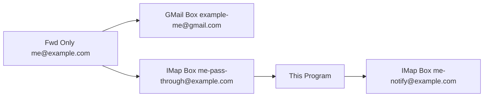
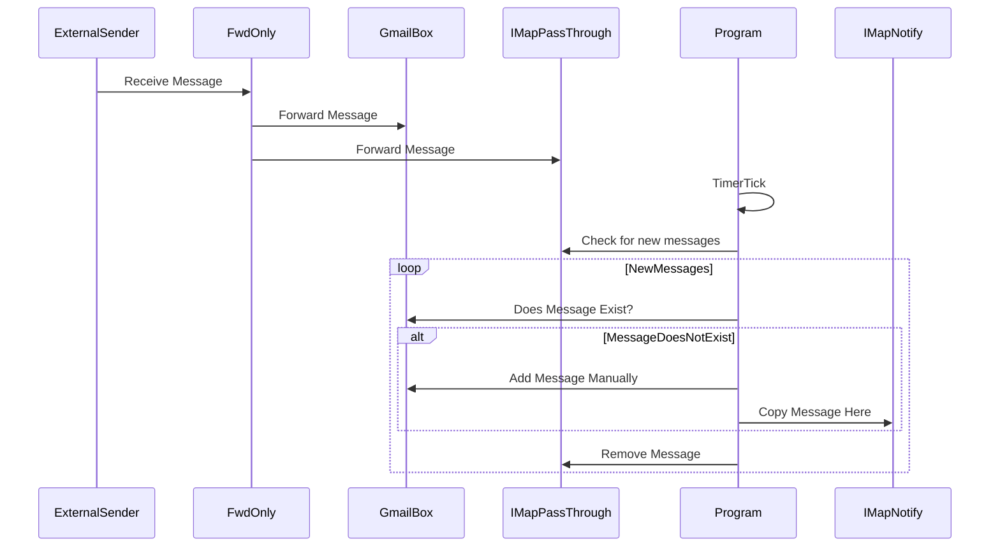

# E-Mail Forward Fixer

There is an issue (with gmail) where emails forwarded from a domain (e.g. me@example.com, noticed when coming from [Dreamhost emails](https://help.dreamhost.com/hc/en-us/articles/115000326592-Using-Gmail-to-access-your-DreamHost-email-account)) to Gmail (e.g. example-me@gmail.com) will occasionally (maybe 1 in 100) get rejected. 

The goal of this is to provide a backup-check where emails that did not successfully forward will still be something that can be quickly notified.

# Architecture

Message Flow

How it runs

